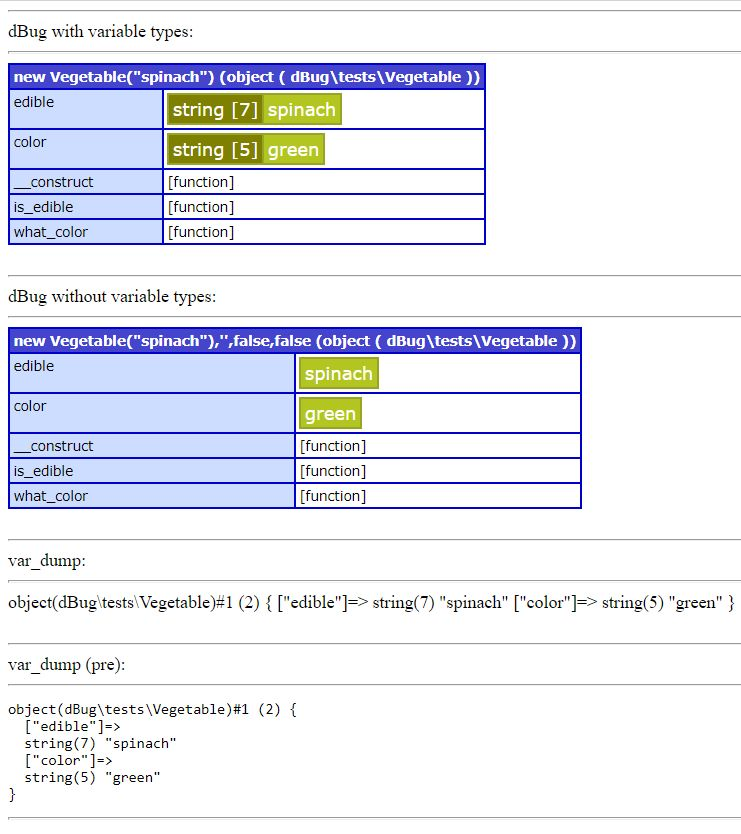

dBug
====
A debug output library which is used to visualize different datatypes.  

It is an alternative to var_dump() that only requires a simple file and no external dependency.

It also allows, variables, arrays, objects, etc.

Initially was developed by ospinto and updated by kolanich

[](https://openhub.net/p/php-dbug)

It is a comparison between dBug and var_dump:



## About this fork 

### 7 May 2020

* This fork adds the changes from kolanich and ospinto.  (I'm not pulling back because I removed some features)
* It also adds a new functionality, to be able to show the values without the variable types.
* Doxigen is removed. Instead, it used phpdoc (it's more standard). I also removed all references to it.   
* Updated composer.json
* Reformatted .php file
* Adding use to classes.  
* Removed unused variables and fields.
* Refactored some methods and some for are converted into foreach.
* docs and examples removed from non-dev installation (.gitattributes)

Usage with variables:

```php
new dBug\dBug($someVariable);
```

Forcing the type :

```php
new dBug\dBug($someVariable,'array');
```

Default collapsed :

```php
new dBug\dBug($someVariable,'array',true);
```


Or without variable types

```php
new dBug\dBug($someVariable,'',false,false);
```

## Installing without Composer.

* Copy dBug.php in some folder.   
* Include in your code: include 'dBug.php'; 
* Call it: new dBug\dBug($variable);  


## Installing this version via Composer

Add the next lines to composer.json and rebuild

```json
{
  "name":  "eftec/dBug",
  "repositories": [
    {
      "type": "vcs",
      "url": "https://github.com/eftec/dBug.git"
    }
  ],
  "require": {
    "eftec/dBug": "dev-master"
  }
}
```


## Very very brief list of features

Extended PHP version of ColdFusion's cfdump.

Outputs colored and structured tabular variable information.

Variable types supported are: Arrays, Classes/Objects, Database and XML Resources.

Ability to force certain types of output. Example: You can force an
object variable to be outputted as an array type variable.

Stylesheet can be easily edited.

Table cells can be expanded and collapsed.

It's FREE!!!
